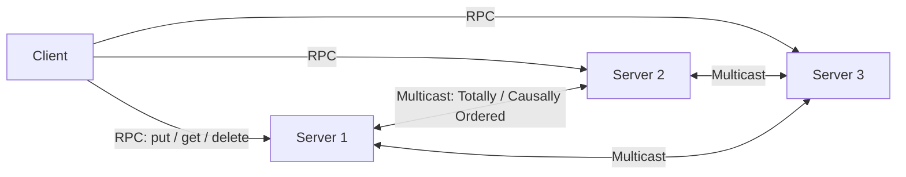
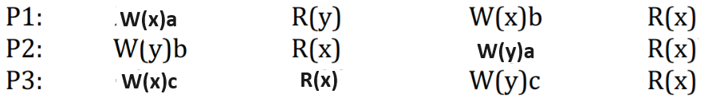
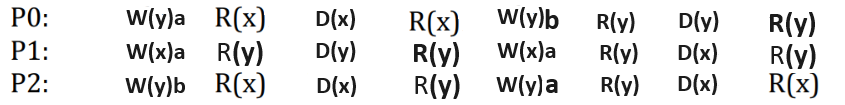

# SyncKey

A replicated key-value datastore in Go, kept consistent across replicas via **Totally-Ordered** and **Causally-Ordered Multicast**.

Developed for the *Sistemi Distribuiti e Cloud Computing* (SDCC) course at Università degli Studi di Roma Tor Vergata, by Marco Lorenzini.

[](https://go.dev/) [](https://pkg.go.dev/net/rpc) [](https://docs.docker.com/compose/) [](https://aws.amazon.com/ec2/)

## Overview

In a distributed system, replicating data across multiple nodes raises a core question: in what order should concurrent operations from different clients be applied everywhere, so that every replica ends up in the same state? This project implements and compares two classic answers to that question in a small replicated key-value store:

- **Sequential consistency**, via a **Totally-Ordered Multicast** built on Lamport scalar clocks — every replica applies all `put`/`delete` operations in the *same* global order, giving the illusion of a single copy, at the cost of an acknowledgment round-trip between replicas before a message becomes deliverable.
- **Causal consistency**, via a **Causally-Ordered Multicast** built on vector clocks — replicas only need to agree on the relative order of *causally related* operations, which is cheaper but a weaker guarantee than sequential consistency.

Both algorithms are implemented from scratch over Go's `net/rpc`, with clients free to choose which consistency mode to use per session, and correctness is validated against classic operation-interleaving test cases (see [Testing](#testing) below).

## Architecture



Three server replicas, each holding a full copy of the key-value store, communicate over RPC to multicast every write among themselves before applying it locally. A client can talk to any replica and issue `put`, `get` and `delete` operations; the consistency mode (causal or sequential) is chosen per call and drives which multicast algorithm the servers run.

## How it works

- **Message ordering.** Each `Message` carries an operation type (`put`/`delete`/`get`), a client id and a per-client sequence number, so servers can enforce FIFO delivery per client before ordering across clients.
- **Sequential consistency** (`serverOperation/serverSequentialAlgorithm.go`): a `MessageSequential` carries a Lamport scalar timestamp; a message is only delivered once every replica has acknowledged it, guaranteeing a single total order across all servers.
- **Causal consistency** (`serverOperation/serverCausalAlgorithm.go`): a `MessageCausal` carries a vector timestamp (one entry per replica); a message is delivered as soon as it's been seen by every process it causally depends on, without needing global agreement.
- **Datastore.** Each server keeps its own `map[string]string` protected by a mutex, applied to only after the message has become deliverable under the chosen ordering.

## Testing

Correctness was validated with concurrent clients issuing interleaved read/write sequences designed to expose ordering violations, and checking that every replica's log reflects a consistent order:

| Sequential consistency test | Causal consistency test |
|---|---|
|  |  |

Across both algorithms, sequential consistency showed higher latency due to the acknowledgment-based total order, while causal consistency traded that global illusion of a single copy for lower overhead — the expected trade-off between strength of guarantee and performance.

## Tech stack

- **Go 1.21** — `net/rpc` for inter-node communication, goroutines for concurrency
- **Docker Compose** — local multi-replica deployment (3 servers + client)
- **AWS EC2** — cloud deployment target
- **godotenv / UUID** — configuration loading and unique message IDs

## Project structure

```
clients/            # Client: RPC dialing, put/get/delete handling per consistency mode
servers/             # server1.go, server2.go, server3.go — replica entry points
serverOperation/     # Totally-Ordered (sequential) and Causally-Ordered (causal) multicast implementations
common/               # Shared RPC message/response structures
serversAddrLocal.json    # Replica addresses for local runs
serversAddrDocker.json   # Replica addresses for Docker Compose runs
DockerfileServer, DockerfileClient, docker-compose.yaml
start.sh, start.bat       # Local or Docker startup, per OS
```

## Getting started

**Local (Linux/macOS)**
```bash
chmod +x start.sh
sh start.sh 1
```

**Local (Windows)**
Set `CONFIG=1` in `.env`, then:
```bat
start.bat 1
```

**Docker Compose**
Set `CONFIG=2` in `.env`, then run `start.sh 2` / `start.bat 2` (or `docker compose up --build -d` directly). To issue operations from inside the running client container:
```bash
docker exec -it synckey-client-1 ./clientTests
```
Server logs (3 replicas) can be followed live with `docker logs -f synckey-server1-1` (replace the index for other replicas).

**AWS EC2**: launch an instance (e.g. Amazon Linux), SSH in, install `git` and `docker-compose`, clone the repository and follow the Docker Compose steps above.

## Report

A full write-up of the consistency models, the multicast algorithms and the validation tests is available in [`ArticoloScientificoSDCC.pdf`](ArticoloScientificoSDCC.pdf), with accompanying slides in [`ProgettoSDCC.ppsx`](ProgettoSDCC.ppsx).
